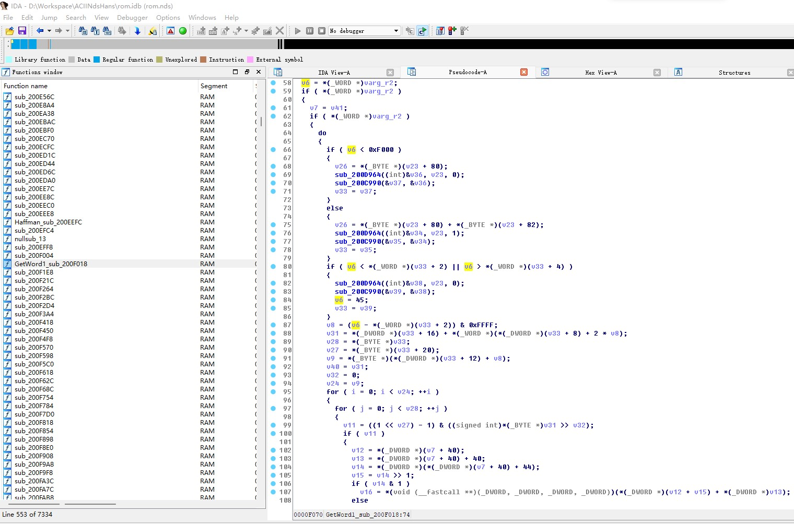

# Nds刺客信条2探索汉化初探

# Table of Contents

1.  [解包](#orgfec708e)
2.  [文本定位](#orgdbf379c)
3.  [文本解密](#org807f43b)
    1.  [huffman 压缩](#org0e4a200)
4.  [取字定位](#org82c9747)

# 解包

tinke+glob.bin插件

# 文本定位

通过文件名判断，锁定Strings\_xx.strings。

替换Strings\_us.strings为Strings\_FC.strings并启动游戏测试，可以看到语言变更为法语，因此确定文本位于Strings\_xx.strings.

# 文本解密

文本通过差值搜索无法找到，猜想文本经过加密，启动游戏运行至文字出现，Dump出内存再次进行差值搜索，定位至解密文本存储位置。

在此位置添加写入断点，定位至加密程序。可知算法：

## huffman 压缩

最终文本存放至22bcfc0

文本指针：22bf24c+偏移量存放偏移量，22c0b2c（fd545abf）存放 huffman 压缩后字节

取一字节0 1展开，按比特逐位判断

22bf0b4（00006501） 处存放 huffman 树，四字节一组，前两字节左子树，后两字节右子树

大于100代表继续往下寻找，否则为目标编码

遇到00终止符结束

自动化解密详见代码getText.py

# 取字定位

因为font文件位于Glob.bin压缩包内，无法直接定位

故出现文字之后暂停dump，搜索font文件二进制代码+0x2000000定位，ida逆向分析。

最终得知取字模子程序位于200F018，取编码值在0200F03A，为半字读取，支持双字节。

编码读取位置在22bcfc0，故只需修改22bcfc0处编码（因为有很多处中间拷贝）

